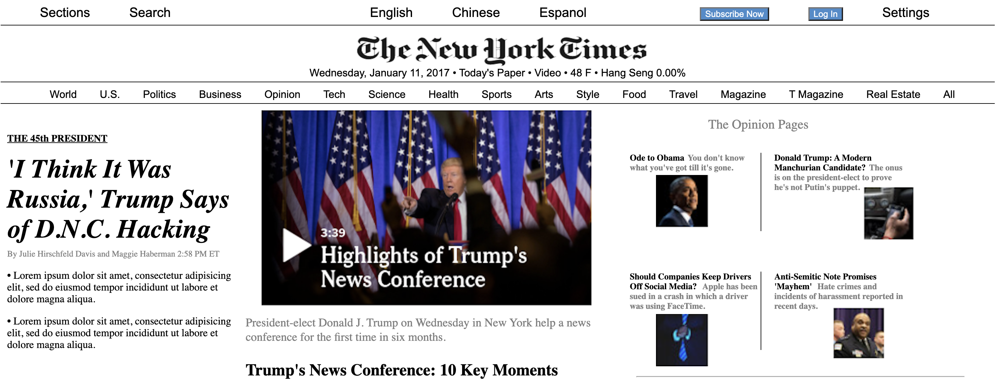

# New York Times Website 
A prototype of the popular news site, nytimes.com. This demonstrates responsive web design for desktop, tablet, and mobile devices.

**View project in browser:** https://dfdev-nyt.netlify.app

## Design and Development
**Skills Used** HTML, CSS:
I built this by breaking down section by section of the original site. 

## Lessons Learned
Writing and mapping out my code before I began was extremely helpful as it cuts down significantly on time.
